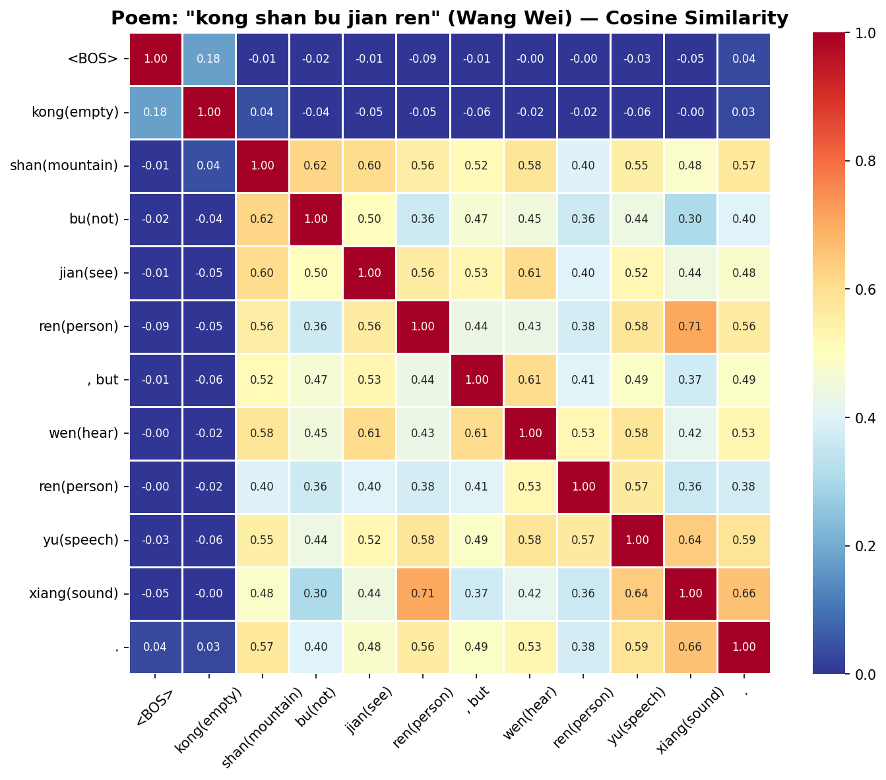
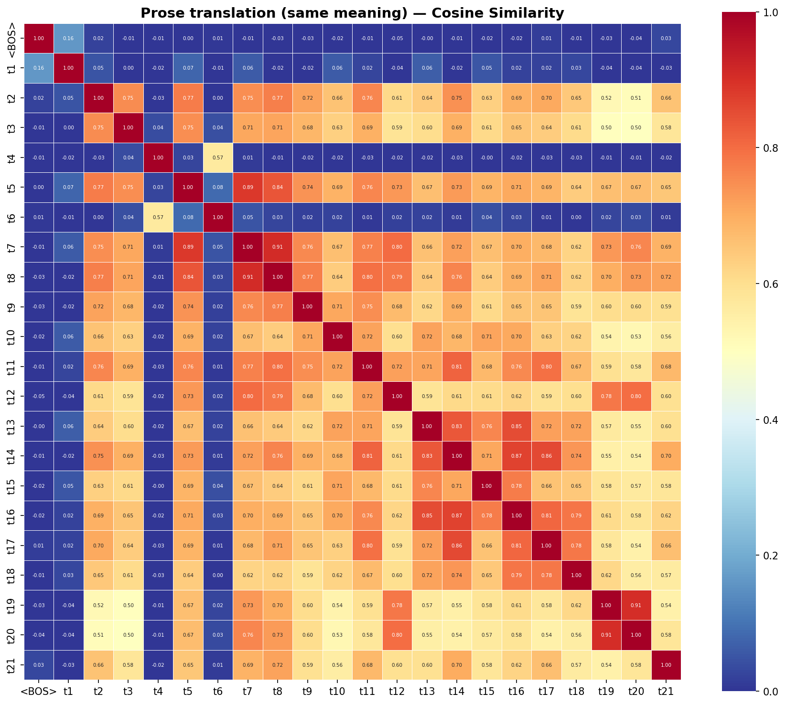

# 诗歌虫洞实证：用 LLM 潜空间看见语义折叠

> **"诗歌是高维语义空间的折叠艺术"——这句话能不能被实验验证？**

---

## 问题的起源

EmrysRyu 在《硅基诗学》中提出：古典诗歌的核心美学机制——意象正交、维度折叠、虚实门控——本质上是高维语义流形上的几何操作。

这是一个漂亮的理论。但理论需要实证。

LLM 的潜空间（latent space）给了我们一台"语义显微镜"：把诗句和白话喂进同一个模型，提取残差流、注意力矩阵、SAE 特征分解——如果诗歌真的在做维度折叠，我们应该能**看见**它。

---

## 核心假说

**诗歌在 LLM 潜空间中的语义轨迹，存在可观测的非连续跳跃（虫洞），而表达相同语义的白话文则沿测地线平滑过渡。**

这不是一个关于"AI 能不能读诗"的问题。这是一个关于**语言结构本身**的问题——虫洞是诗句的拓扑属性，不依赖于谁在读它。LLM 只是让我们能量化观测这个属性的工具。

---

## 为什么一首诗不够

如果只拿"春风知别苦，不遣柳条青"做实验，我们最多能证明"这首诗有跳跃"。这不够。

要证明的是：**虫洞是诗歌的结构性特征，而非个案巧合。**

EmrysRyu 的《硅基诗学》已经给出了答案——不同的诗对应**不同类型的几何操作**。我们不是找更多诗来重复验证同一件事，而是验证**每一种折叠类型都能被观测到**。

---

## 五种折叠，五组实验

基于《硅基诗学》的分类框架，选取五种不同的语义几何操作，每种配一组诗/白话对照：

### 类型一：跨簇拟人（Cross-Cluster Personification）

**诗**：春风知别苦，不遣柳条青。（李白《劳劳亭》）

**白话**：春天来了，微风吹过，让人想到离别的伤感，所以看到柳树还没变绿，心里更加难过。

**虫洞结构**："知"把自然物候簇和人间情感簇瞬间焊接。白话用 5 步走完同样的语义距离。

**对应《硅基诗学》**：意象正交基——两个正交子空间被一个字桥接。

### 类型二：单维奇点（1D Singularity）

**诗**：大漠孤烟直，长河落日圆。（王维《使至塞上》）

**白话**：广阔的沙漠上一缕孤零零的炊烟笔直地升起，远处黄河边上一轮落日又大又圆。

**虫洞结构**："直"在全零背景（大漠的熵死寂）中制造单点跃迁。白话用形容词铺陈（"笔直地""又大又圆"），没有奇点。

**对应《硅基诗学》**：极致的单维奇点——无限平坦背景中的单一信号。

### 类型三：感知通道冲突（Sensory Channel Conflict）

**诗**：空山不见人，但闻人语响。（王维《鹿柴》）

**白话**：山里空荡荡的看不见人，只是偶尔听到有人说话的声音。

**虫洞结构**：视觉通道归零（空、不见），听觉通道突然激活（闻、响）——两个正交感知维度的逻辑门冲突。白话用"只是偶尔"平滑过渡，消解了冲突。

**对应《硅基诗学》**：信噪比的极限博弈——正交感知通道携带矛盾的存在性信息。

### 类型四：时间尺度坍缩（Temporal Scale Collapse）

**诗**：君不见高堂明镜悲白发，朝如青丝暮成雪。（李白《将进酒》）

**白话**：你看那高堂上对着镜子悲伤白发的人，早上头发还是黑的，到了晚上就白了。

**虫洞结构**："朝""暮"把一生压缩进一天——时间维度的极端折叠。白话按字面翻译了"早上""晚上"，时间尺度没有跨越。

**对应《硅基诗学》**：跨维度扭矩——从微观个体到宇宙时间尺度的急剧转换。

### 类型五：多维强制对齐（Multi-Vector Alignment）

**诗**：落霞与孤鹜齐飞，秋水共长天一色。（王勃《滕王阁序》）

**白话**：晚霞和一只孤独的野鸭一起飞翔，秋天的江水和辽阔的天空连成一片，颜色完全一样。

**虫洞结构**：四个异质实体（落霞、孤鹜、秋水、长天）通过"齐飞""一色"两个公共参数被压缩进同一概率区间。白话需要逐个描述再解释关系。

**对应《硅基诗学》**：多维向量的强制对齐——通过底层公共参数实现万物互联。

---

## 实验设计

### 模型

| 用途 | 模型 | 说明 |
|------|------|------|
| 实验一+三+EID | Llama-3.3-70B-Instruct-INT8 | d_model=8192, 80 层 |
| 实验四 SAE | Llama-3.3-70B-Instruct + Goodfire SAE-l50 | 预训练 SAE |

### 实验矩阵

| 实验 | 测什么 | 结果 |
|------|--------|------|
| 一：残差流轨迹 + 跳跃距离 | 逐 token 欧氏距离 | ❌ 无显著差异（测的是 tokenizer 边界效应） |
| 二：注意力矩阵 | 关键字注意力分布 | ⛔ 砍掉（70B output_attentions 会死机） |
| 三：余弦相似度 | token 对之间的语义距离 | ✅ **5 组全部显著** |
| EID：有效内在维度 | SVD 谱熵，量化语义体积 | ✅ **5 组全部显著** |
| 四：SAE 特征分解 | 双域共激活检测 | ✅ **5 组桥接 token 均检测到跨域共激活** |

**每个实验跑 5 组诗/白话对照。**

---

## 实验结果

### 实验三：余弦相似度 — 诗 = 正交，白话 = 冗余

最后一层 hidden states 的 token×token 余弦相似度矩阵，统计非对角线（距离 > 2）中相似度 > 0.8 的 token 对数量：

| 诗组 | 诗 | 白话 |
|------|-----|------|
| 春风知别苦（李白） | **0** | 15 |
| 大漠孤烟直（王维） | **0** | 9 |
| 空山不见人（王维） | **0** | 5 |
| 君不见高堂（李白） | **0** | 4 |
| 落霞与孤鹜（王勃） | **0** | 32 |

**5 组诗全部 = 0，白话全部 > 0。** 热力图对比（以"空山不见人"为例）：




诗组除对角线和相邻位置外全蓝（token 高度正交），白话组大面积红橙（远距离 token 共享语义空间）。

### EID：有效内在维度 — 诗用更少的字撑开更大的语义体积

对最后一层 hidden states（token×d_model）做 SVD，计算谱熵 → EID = exp(H)。归一化 EID = EID / token 数，消除长度偏差。

| 诗组 | 诗·归一化EID | 白话·归一化EID | 比值 |
|------|-------------|---------------|------|
| 春风知别苦 | 0.643 | 0.205 | **3.13x** |
| 落霞与孤鹜 | 0.496 | 0.177 | **2.81x** |
| 君不见高堂 | 0.509 | 0.214 | **2.38x** |
| 大漠孤烟直 | 0.505 | 0.214 | **2.36x** |
| 空山不见人 | 0.561 | 0.269 | **2.08x** |

**5 组归一化 EID 比值全部 > 2x。** 诗的每个 token 平均占据的有效语义维度是白话的 2~3 倍。


### 实验四：SAE 特征分解 — 桥接 token 的双域共激活

用 Goodfire SAE（Layer 50）将 hidden state 分解为可解释特征，检测桥接 token 是否同时激活多个语义域。

**桥接 token 的跨域共享：**

| 诗组 | 桥接token | SAF | 最强共享 | Jaccard | Pearson | 共享特征 | 解读 |
|------|----------|-----|---------|---------|---------|---------|------|
| 春风知别苦 | **知** | 141 | 别/苦 | 0.11-0.12 | 0.58/0.50 | 31-32 | 同时激活自然域（风）和情感域（别苦） |
| 大漠孤烟直 | **直** | 125 | 烟/长 | 0.17/0.14 | 0.56/0.55 | 39/31 | 桥接视觉形态域和空间尺度域 |
| 空山不见人 | **闻** | 167 | ，但/人₂/见 | 0.22/0.22/0.19 | 0.65/0.54/0.48 | 61/59/50 | 同时激活视觉域和听觉域，**共激活最强** |
| 君不见高堂 | **暮** | 160 | 成/朝/丝 | 0.20/0.13/0.14 | 0.63/0.65/0.61 | 50/33/41 | 桥接时间起点（朝）和终点（成雪） |
| 落霞与孤鹜 | **齐** | 184 | 飞/鹜₂/一 | 0.26/0.20/0.16 | 0.69/0.66/0.56 | 70/65/45 | 同时激活运动域和色彩域，**共享最广** |

**关键发现：**

1. **桥接 token 全部呈现双域/多域共激活**：每个桥接 token 都与来自不同语义域的 token 共享大量 SAE 特征（Jaccard 0.11~0.26），Pearson 相关 0.48~0.69
2. **「空」与「闻」共享特征 = 0**：视觉清零和听觉激活在 SAE 特征层完全正交——正是《硅基诗学》说的"感知通道冲突"
3. **「齐」的共享最广**（与 14 个 token 都有共享）：作为"多维强制对齐"的桥接 token，它确实在 SAE 层面把所有实体焊接在一起

### 三个实验互相印证

| 实验 | 测什么 | 结论 |
|------|--------|------|
| 余弦相似度 | token 之间是否正交 | 诗的 token **互相正交**（5 组全 0） |
| EID | 正交的后果：语义体积多大 | 诗的每 token 语义体积是白话的 **2~3 倍** |
| SAE | 桥接 token 如何连接正交的域 | 桥接 token **同时激活多个语义域的特征** |

**完整图景：诗的意象互相正交（余弦相似度），每个字撑开独立维度（EID），而桥接字在微观特征层面同时属于多个域（SAE）——这就是虫洞的机制。正交是结构，桥接是连接，两者共同构成维度折叠。**

### 实验一：跳跃距离 — 无显著差异（阴性结果）

| 诗组 | 跳跃距离比 |
|------|-----------|
| 春风知别苦 | 0.96x |
| 大漠孤烟直 | 1.04x |
| 空山不见人 | 0.99x |
| 君不见高堂 | 0.99x |
| 落霞与孤鹜 | 1.02x |

**欧氏距离测的是 tokenizer 边界效应，不是语义跳跃。** 这个指标本身不对——余弦相似度和 EID 才是正确的度量。

---

## 续集：换一台 MoE 模型再看一遍（DeepSeek V4 Flash，2026-06）

上面的实验是在 **Llama-3.3-70B（dense 模型）** 上做的。同一组 5 首诗，我们换到 **DeepSeek V4 Flash（280B MoE，256 个专家选 6 + 1 共享）** 上重跑，想看两件事：

1. **「字和字正交」这个结论换个架构还成立吗？**（稳健性检验）
2. **MoE 的专家路由能不能给「正交」一个更直接的画面？**——dense 模型只能用余弦相似度间接看，MoE 把每个字派给哪些专家是明摆着的。

代码与数据见 [`v4_deepseek/`](v4_deepseek/)（实验平台为 [deepseek-v4-experimental-platform-on-dgx-spark](https://github.com/lmxxf/deepseek-v4-experimental-platform-on-dgx-spark)，双机 TP=2 流式加载，hook 每层 hidden states + MoE Gate 路由）。

### V4 结果一：余弦正交 — 跨架构复现 ✅

最后一层附近（layer 28）hidden states 的非对角线高相似度 token 对（同 Llama 口径）：

| 诗组 | 诗·高相似对 | 白话·高相似对 |
|------|:----------:|:------------:|
| 李白《劳劳亭》 | 0 | 34 |
| 王维《使至塞上》 | 0 | 0 |
| 王维《鹿柴》 | 1 | 8 |
| 李白《将进酒》 | 1 | 0 |
| 王勃《滕王阁序》 | 1 | 2 |

**诗全部 ≤1，白话普遍更高。** 「字和字正交」在 MoE 架构上同样成立——这不是 Llama 的特性，是语言结构本身的属性。

### V4 结果二：EID — 部分复现，但弱于 dense ⚠️

归一化 EID 比值（layer 28）：1.11~2.16x，全部 > 1，但**没有 Llama 上那么干净的 2~3x**。

EID 是个对模型架构敏感的脆弱指标（SVD 谱熵依赖隐藏维度和奇异值谱形状，dense 8192 维 80 层 vs MoE 4096 维 43 层不可直接比）。**诚实记录：余弦正交是稳健信号，跨架构都在；EID 是脆弱信号，换模型就打折。**

### V4 结果三：专家路由 — 正交的「另一把显微镜」🔥

这是 MoE 独有、dense 做不了的。每个字进 MoE 层时，router 从 256 个专家里挑 6 个点亮。我们 hook 出每个字的专家集合，算两两 Jaccard 重叠。

**(a) 桥接字坐在专家空间的「中间」。** 5 个桥接字（知/直/闻/暮/齐）和句中其他字普遍 0.33~0.71 重叠，没有一个掉到 0——它们不偏科，跟两侧的语义域都搭得上。其中「闻」（《鹿柴》）和视觉域的「空/山/不见」都是 0.50 重叠：

```
桥接字「闻」专家重叠: 但=0.71  空=0.50  山=0.50  不见=0.50  人=0.50 … 响=0.20
```

**这和原实验用 Goodfire SAE 测出的「闻是桥接字」是同一个结论——换了一把完全不同的显微镜（专家路由 vs 稀疏特征分解），同一个字，同一个答案。**

**(b) 浅层→深层的「语义点火」相变。** 前 3 层是哈希路由（专家由 token id 定死，跟语义无关），第 3 层起是分数路由（按语义内容选专家）。5 首诗完全一致：

| 层 | 路由类型 | 9 实义字用的不同专家数 | 被半数+字共享的专家 |
|----|---------|:-------------------:|:------------------:|
| L0 | 哈希 | ~50（几乎全散开） | 空集 |
| L3 | 分数 | ~18（骤降） | 一批共享专家 |

浅层每个字「各进各家」，深层「全班抱团」共享一批语境专家。

**(c) 「文言文专家」实锤。** L3 上专家 **46 / 69 / 143 / 175 / 186** 在 5 首诗里全部出现——不管李白、王维还是王勃，不管写离别、边塞还是登高，只要是「一句古诗」，就点亮这同一批专家。深层（L42）再换一批（2 / 95 / 148 / 163）接管。

### dense vs MoE 小结

| | Llama-70B (dense) | DeepSeek V4 (MoE) |
|---|---|---|
| 字和字正交 | ✅ 余弦相似度 | ✅ 余弦相似度（复现） |
| 正交的直接证据 | 间接（向量夹角） | 直接（专家不重叠） |
| 桥接字 | SAE 双域共激活 | 专家路由居中重叠 |
| EID 2-3x | ✅ | ⚠️ 1.1~2.2x，打折 |
| 语义点火可视化 | ❌ 做不了 | ✅ 哈希→分数相变 |

**MoE 没有推翻 dense 的结论，它给同一个结论换了一种、更有画面感的现身方式。**

---

## 运行环境

```bash
# Docker 容器
docker exec -it poet_exp bash

# 模型位置
/workspace/models/Llama-3.3-70B-Instruct-INT8

# 运行实验
python /workspace/ai-theorys-study/arxiv/wechat121/exp123_qwen72b.py
```

详见 [DevHistory.md](DevHistory.md) 获取容器配置、版本依赖、踩坑记录。

---

## 方法论预警

这些实验观测的是**模型对诗歌的理解过程**，不是诗人的创作过程。我们不能说"李白的大脑也是这样工作的"。

但是——

文字结构在语义空间中的拓扑跳跃是**客观的**。不管是人脑还是 LLM，"春风知别苦"这句话的语义结构就是在做跨簇跳跃。模型的隐状态空间只是给了我们一个可以量化观测这个跳跃的工具。

打个比方：用显微镜看细胞，显微镜不是细胞，但细胞的结构是客观存在的。LLM 的潜空间就是我们观测诗歌语义拓扑的"显微镜"。

---

## 与《硅基诗学》的关系

| 《硅基诗学》 | 本实验 |
|-------------|--------|
| 理论：诗歌是维度折叠 | 实证：用潜空间看见折叠 |
| 定性：五种几何操作的分类 | 定量：跳跃距离、注意力熵、共激活得分 |
| 推测：正交意象产生跨集群共振 | 验证：SAE 特征分解检测双域共激活 |

**EmrysRyu 画了地图，我们去实地测量。**

---

## 参考

- EmrysRyu,《[硅基诗学：人工智能视角下的中国古典诗歌语义几何学](https://emrysryu.github.io/Wandering-Beyond-the-Code/#/double-Dutch/%E7%A1%85%E5%9F%BA%E8%AF%97%E5%AD%A6%E8%AE%BA%E6%96%87)》, 2026
- [Llama-3.3-70B SAE Inspect](https://github.com/lmxxf/llama3-70b-sae-inspect)
- Goodfire, [Llama-3.3-70B-Instruct-SAE-l50](https://huggingface.co/Goodfire/Llama-3.3-70B-Instruct-SAE-l50)
- Anthropic, [The Assistant Axis](https://arxiv.org/abs/2601.10387), 2026

---

*朱雀，2026-03-14*
